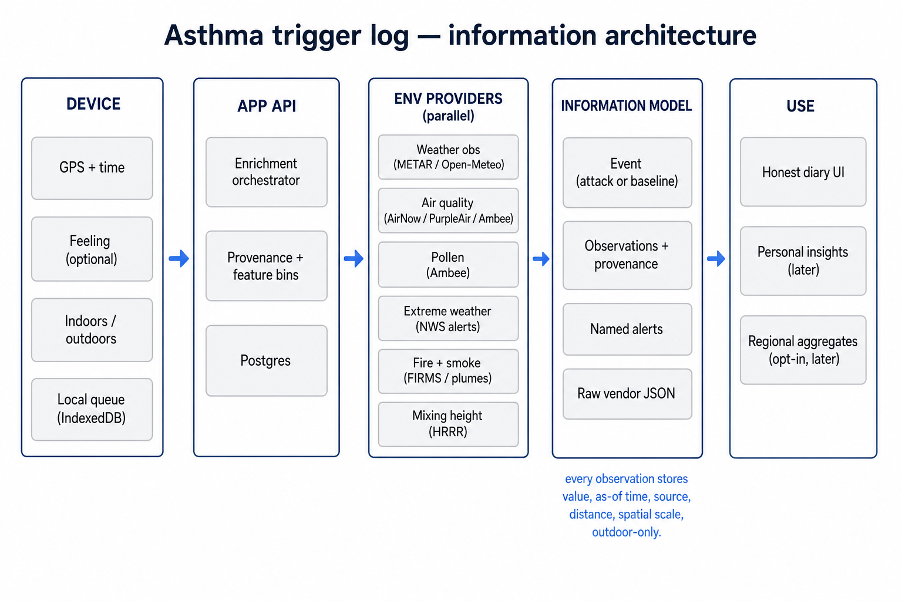
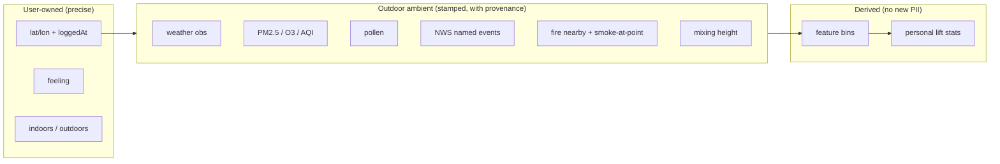
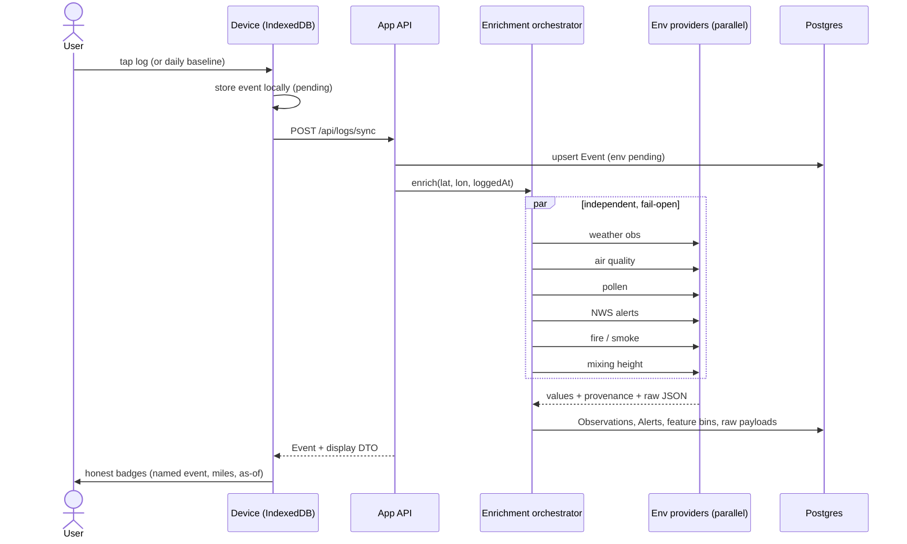
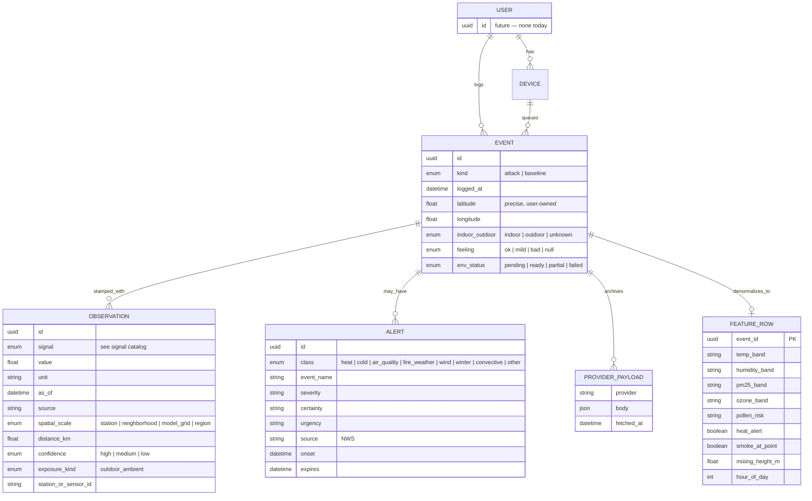
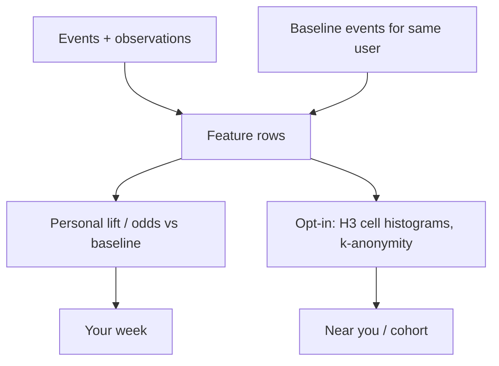
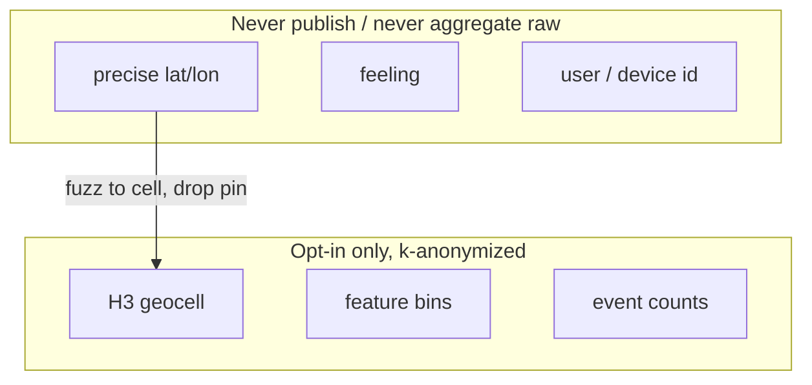

# Information / data architecture

Sketch of how the asthma trigger log should hold and move data — current prototype plus the aggregator-ready target. Pair with [env-signals-and-aggregators.md](./env-signals-and-aggregators.md).



---

## 1. Context — who owns what



Precise GPS never leaves the user’s event row. Providers only receive a rounded point (or the same pin, server-side) and return **outdoor** fields. Insights run on bins (`pm25_band`, `heat_alert`, …), not on raw coordinates.

**Today:** one `AttackLog` row with flattened env columns and `envRawJson`. No user account, no baseline events, no per-observation provenance.

---

## 2. Runtime flow



Each provider is optional. A missing AirNow key must not block temperature or alerts.

---

## 3. Logical information model



`FEATURE_ROW` is what personal insights (and later k-anonymized aggregates) should read. Swap Ambee for AirNow without changing the insight jobs.

---

## 4. Signal catalog (what an Observation can be)

| Signal | Unit | Typical source | Spatial scale we should claim |
|--------|------|----------------|-------------------------------|
| `temperature` | °F | METAR / Open-Meteo / Ambee weather | station or model_grid |
| `humidity` / `dewpoint` | % / °F | same as temperature | same |
| `pm25` | µg/m³ | OpenAQ nearest station, AirNow fallback, Ambee model | station / neighborhood / model_grid |
| `ozone` | ppb | OpenAQ nearest station, AirNow fallback, Ambee model | station or model_grid |
| `aqi_us` | index | derived from pollutants | inherits driver pollutant |
| `pollen_tree` / `_grass` / `_weed` | count or risk | Ambee (gap today) | model_grid |
| `mixing_height` | m | HRRR / Open-Meteo | model_grid |
| `nearest_fire_km` | km | FIRMS / Ambee fire | satellite pixel |
| `smoke_at_point` | 0/1 or density | plume model or high PM2.5 | model_grid |

**Not observations** (they are `ALERT` rows): Heat Advisory, Red Flag, Air Quality Alert, Severe Thunderstorm, etc.

**Split wildfire** into alert (`fire_weather`) + observation (`nearest_fire_km`) + observation (`smoke_at_point`). Do not store a single `hasWildfireNearby` boolean.

---

## 5. Observation record (the honesty contract)

Every env number the UI shows is an `OBSERVATION`, not a bare column.

```json
{
  "signal": "pm25",
  "value": 27.4,
  "unit": "ug/m3",
  "asOf": "2026-09-01T16:00:00Z",
  "source": "airnow",
  "spatialScale": "station",
  "distanceKm": 17.6,
  "confidence": "high",
  "exposureKind": "outdoor_ambient",
  "stationOrSensorId": "Denver-CAMP",
  "display": "Outdoor PM2.5 27 µg/m³ · 11 mi from Denver-CAMP · 4:00p"
}
```

If `spatialScale` is `model_grid` or `distanceKm` is large, copy says **regional** or **modeled**, not **at your location**.

---

## 6. Today vs target (mapping)

| Today (`AttackLog`) | Target |
|---------------------|--------|
| one row, attack only | `EVENT.kind` = `attack` \| `baseline` |
| `feeling` | stays on event |
| — | `indoor_outdoor` |
| `temperatureF`, `isExtremeTemp` | observations + `temp_band` / heat alert |
| `aqi`, `aqiCategory` | `pm25`, `ozone`, `aqi_us` observations + distance |
| `hasStormAlert`, `stormSummary` | `ALERT[]` with NWS class + event name |
| `hasWildfireNearby`, `wildfireSummary` | fire-weather alert + `nearest_fire_km` + `smoke_at_point` |
| `possibleInversion` | `mixing_height` observation |
| `envRawJson` | `PROVIDER_PAYLOAD` per source |
| `deviceId` unused | `DEVICE` + later `USER` |
| GET last 100 logs, no auth | user-scoped events; precise GPS not in aggregates |

A first migration can keep a wide event table and add `observations Json` + `alerts Json` beside the old columns. Split tables when insights land.

---

## 7. Insights path (does not change the event model)



No vendor belongs in this layer. If Ambee replaces AirNow, only the observation `source` and `spatialScale` change.

---

## 8. Privacy boundary



Outdoor provider calls are not a privacy leak of identity, but storing everyone’s pins in one unauthenticated `GET /api/logs` is. Auth + user scope is part of this architecture, not a later nice-to-have if anyone else uses the app.
