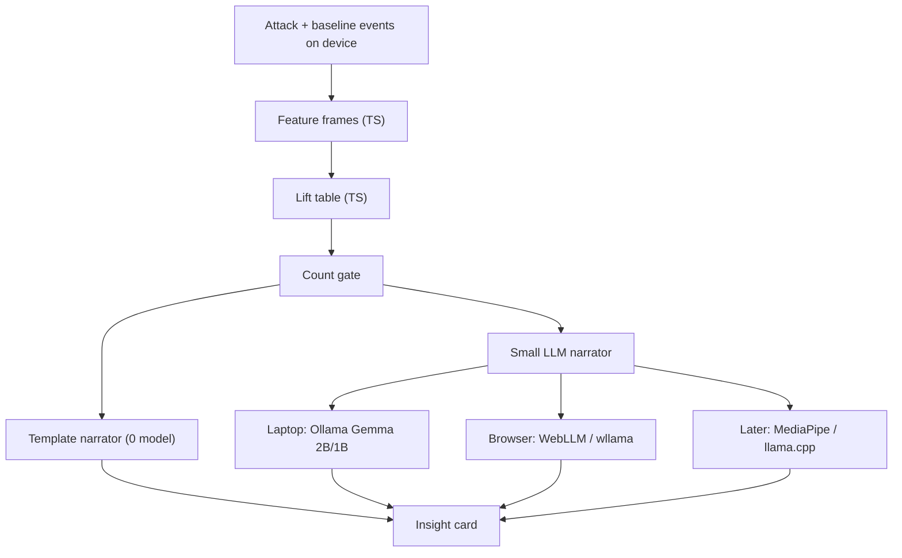

# On-device insights prototype

How a small open model (Gemma-class) fits the asthma diary without becoming the correlation engine. Companion to [predictive-engine.md](./predictive-engine.md). Built so it can be demoed at an AI Perspectives talk.

This is **not medical advice**. The product claim stays: “more common on your logged attacks than on your usual days,” with the counts visible.

---

## Thesis for the talk

> Don’t ask the LLM to find the correlation. Ask it to say the correlation.

Three jobs, three tools:

| Job | Tool | Why |
|-----|------|-----|
| Stamp outdoor air onto a log | Free APIs + optional Ambee | Already in the app |
| Measure lift (attack rate vs usual rate per bin) | ~50 lines of TypeScript | Deterministic, free, on-device by default |
| Turn the top rows into one honest sentence | Tiny LLM **or** a template | Optional; only sees a table, never raw GPS |

Jev (System One) is still a fourth option for **labeling alert text into bins**. It is not a narrator and not a stats engine. See [predictive-engine.md §8](./predictive-engine.md#8-where-jev-fits).

---

## Why “Gemma finds correlations” is the wrong shape

If you paste 100 logs into Gemma and ask “what weather lines up with attacks?”, you get:

- A different answer every run
- Counts the model invents or rounds
- No baseline comparison unless you also paste baselines
- Battery and tokens spent on arithmetic
- No clean way to show the user the evidence

The efficient shape:

1. Code builds feature bins and a lift table.
2. Code gates bins that lack enough samples.
3. The model receives **only** the gated rows (bin, attack rate, usual rate, lift, counts) plus hard copy rules.
4. The model returns **one short paragraph**. Prefer constrained output (JSON with `headline` + `caveat`) so you can reject “you will have an attack.”

Same table powers “your week,” the predictive score, and the talk demo. Swap the narrator without retuning the science.

---

## Efficiency and on-device path



**What always runs on device:** framing, lift, gating, the card UI, and the template narrator. That is enough for a working product.

**What may run on device:** a 1B–2B instruct model that turns 5–10 table rows into prose. Input is hundreds of tokens, not the diary.

**What should not run on device first:** a frontier chat model over raw `envSnapshotJson`. Wrong cost curve for a talk and for a phone.

### Model size guidance (practical)

| Size | Role in this prototype | Notes |
|------|------------------------|-------|
| Template | Default, always ship | Zero cost; proves the pipeline |
| Gemma 1B–2B instruct | Talk demo / privacy story | Good enough for “say these three rows honestly” |
| 4B+ | Usually unnecessary here | Longer latency; little gain once the table is fixed |
| Cloud frontier | Optional A/B for the talk slide | Show that bigger models still need the table |

Pin a concrete Ollama tag for demos (e.g. `gemma2:2b` or whatever your laptop already has). The scaffold talks to Ollama over HTTP; the model id is an env var.

---

## Input contract for the narrator

The summarizer never sees coordinates, feeling free text mixed with GPS, or provider JSON. It sees:

```json
{
  "nAttacks": 14,
  "nBaselines": 40,
  "season": "late summer",
  "rows": [
    {
      "bin": "ozone",
      "level": "high",
      "attacksWith": 8,
      "baselinesWith": 3,
      "attackRate": 0.57,
      "baselineRate": 0.08,
      "lift": 7.6,
      "gated": true
    }
  ],
  "rules": [
    "Do not claim causation or predict an attack.",
    "Always mention the counts for the top driver.",
    "If no gated rows, say we need more usual days."
  ]
}
```

Output (preferred):

```json
{
  "headline": "High ozone showed up on 8 of 14 attacks vs 3 of 40 usual days.",
  "caveat": "Outdoor air only — not a medical diagnosis.",
  "drivers": ["ozone:high"]
}
```

If the model returns prose without JSON, the template path is the fallback. Never display an ungated invented correlation.

---

## Talk demo arc (≈8 minutes)

1. **Show the diary stamp** — one attack log with outdoor badges (existing app).
2. **Show the lift table** — gated rows only; highlight that this is code.
3. **Flip narrators** — template → Gemma. Same numbers, different sentence.
4. **Adversarial slide** — paste raw logs into a big chat model; contrast invented stats vs the table.
5. **Privacy slide** — health events stay on device; only the table could leave, and in the on-device path it does not.
6. **Roadmap** — same table scores tomorrow’s forecast ([predictive-engine.md](./predictive-engine.md)); Jev labels alert text into bins if keywords fail.

---

## Scaffold in this repo

| Path | Role |
|------|------|
| `src/lib/insights/lift.ts` | Pure lift / gating |
| `src/lib/insights/demo-frames.ts` | Synthetic frames for the talk |
| `src/lib/insights/summarize.ts` | Narrator interface: template + Ollama |
| `src/app/api/insights/summarize/route.ts` | Optional laptop Ollama proxy |
| `src/app/insights/page.tsx` | Interactive prototype UI |

Open `/insights` after `npm run dev`.

1. **Lift from current data** — merges `/api/logs` (Postgres) with IndexedDB after sync. Attack rows = inhaler logs; usual-day rows = logs where feeling is **ok** (or demo baselines until you have enough ok-days).
2. **Gemma in the browser** — click **Gemma (WebLLM)**. Uses `gemma-2-2b-it-q4f16_1-MLC` via WebGPU; first load downloads ~1.5GB weights to cache. **Chrome/Edge desktop only.**

**iPhone / iPad Safari:** WebLLM is blocked on purpose. Loading Gemma 2B often hard-crashes the tab with “A problem repeatedly occurred” (per-tab memory/GPU limit ≈1–1.5GB — not a recoverable JS error). The template narrator still works on mobile.

Template narrator works with no keys and no GPU. Optional laptop Ollama path: `POST /api/insights/summarize` (see route file).

---

## Build order for the talk

1. Lift + template card on synthetic frames (**done in scaffold**).
2. Wire real `AttackLog` rows → frames once baselines exist.
3. Optional WebLLM path in the browser for a no-Ollama demo.
4. Only then: predictive scoring of forecast hours from the same table.

---

## What we are not scaffolding yet

- Training or fine-tuning Gemma on diary text
- Letting the model propose new bins
- On-device native Mobile builds (MediaPipe / Core ML) — interface-shaped for later
- Cloud-hosted Gemma as a product dependency
