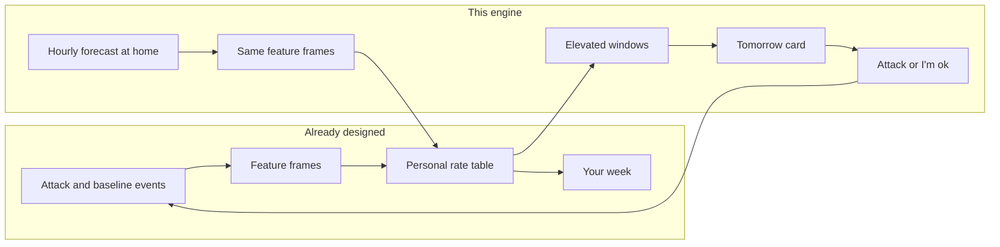
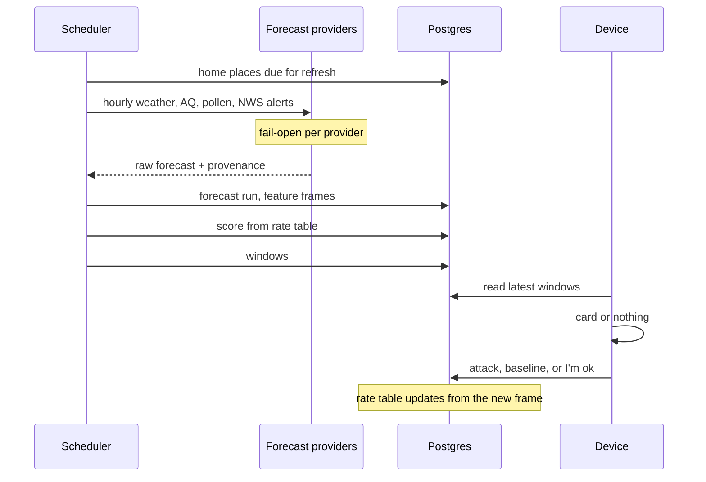
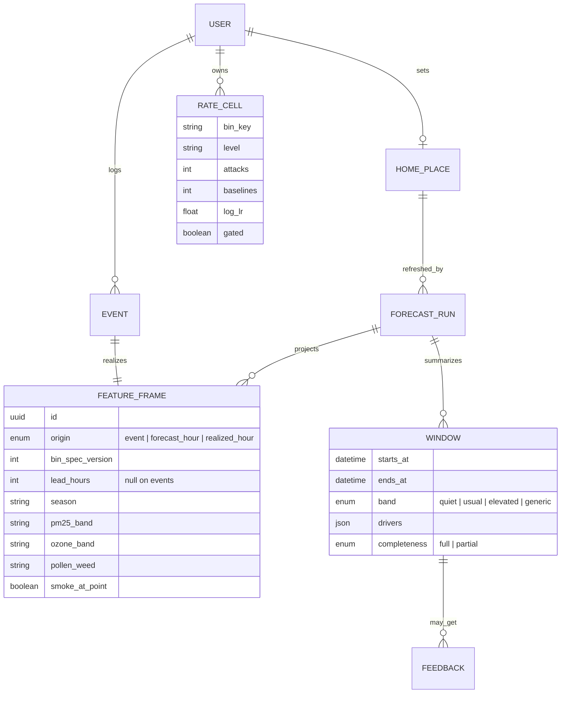

# Predictive engine

How the asthma trigger log goes from stamping attacks after the fact to ranking the next day. Pair with [data-architecture.md](./data-architecture.md) and [env-signals-and-aggregators.md](./env-signals-and-aggregators.md).

This is **not medical advice** and it is **not a forecast of an attack**. It ranks upcoming hours by how much they resemble this person’s logged attacks versus their logged usual hours. The number on screen is a comparison, not a probability of symptoms.

---

## 1. Look back vs look ahead

Today the app waits for a tap, then stamps outdoor context onto that moment. Insights, when they exist, explain the past (“high weed pollen showed up on more of your attacks than your usual days”).

Prediction uses the **same comparison** on hours that have not happened yet. Nothing new is learned at scoring time. Learning happens when a log or a baseline sample lands and updates a rate table. Scoring a forecast is a lookup.



One rate table feeds both reads. A separate model for “the future” would drift from the diary and could not be explained with counts.

---

## 2. What a card is allowed to say

| Say | Do not say |
|-----|------------|
| “Thu 2–7p looks more like your attack hours than your usual ones.” | “You will have an attack.” |
| “Driver: ozone, high. 8 of 12 attacks, 3 of 40 usual days.” | A percentage risk. |
| “Outdoor forecast, not indoor air. We don’t know your pattern yet.” | “Hyperlocal” or “the air you will breathe.” |

Absolute risk is not identified. People log some attacks and not others, and a baseline sample is “no attack reported,” not “this hour was fine.” Case-control style samples support a **likelihood ratio**, not P(attack | weather).

---

## 3. One feature frame for past and future

The failure mode is training on station observations and scoring a different forecast schema. Past events and future hours must pass through the same bins, with the same edges, recorded as `bin_spec_version`.

A frame is one hour at one place:

| Field | Past source | Future source |
|-------|-------------|---------------|
| `temp_band`, `humidity_band`, `dewpoint_band` | Observation at `loggedAt` | Hourly weather forecast |
| `pm25_band`, `ozone_band` | OpenAQ / AirNow / Ambee model | AQ forecast, else last observation marked stale |
| `pollen_tree` / `_grass` / `_weed` | Latest pollen stamp | Pollen forecast |
| `heat_alert`, `aq_alert`, `fire_weather` | NWS alert overlapping the hour | Active or forecast NWS alert |
| `smoke_at_point` | Elevated PM2.5 with fire nearby | Forecast PM2.5 band, not fire-risk |
| `hour_of_day`, `season` | Local time of the event | Local time of the forecast hour |
| `lag_pm25_24h`, `lag_pollen_24h` | Prior stamps or 48h history | Observed recent hours, not the forecast of the past |

Bin edges live in code, not in a prompt. Numeric fields never go through a model to become a band. `pm25 >= 35` is a comparison.

**Non-redundant set.** The score sums evidence. Correlated copies double-count. Prefer the specific signal: PM2.5 over AQI, ozone over AQI, smoke-at-point over “fire within 50 km,” humidity or dewpoint over a second temperature flag. AQI stays on the badge. It does not enter the sum.

**Lead time is part of the frame.** A frame built from a 6-hour forecast is not the same evidence as one built from a 36-hour forecast. Store `lead_hours` and widen the displayed uncertainty as lead time grows. Pollen and ozone at 36h should not look as sharp as temperature at 6h.

**Realized vs forecast.** When that hour passes, stamp a second frame from observations. The backtest needs both, so a miss can be “the rate table was wrong” or “the forecast was wrong.”

---

## 4. Labels

| Kind | When it is written | What it is |
|------|--------------------|------------|
| `attack` | User logs symptoms | Positive. Still not “every attack.” |
| `baseline` | About once a day at the home place, or app-open if none in 20h | Control hour. “Nothing logged,” not a clean lung. |
| `feedback_ok` | User taps “I’m ok” on a card | High-value control, especially if the hour was elevated |
| `feedback_attack` | User logs from a card | High-value positive, tied to a prediction |

Unsampled hours are **missing**, not negatives. The rate table’s denominators are sampled events only.

Place for the daily forecast is a **home pin** the user sets (or the first pin they confirm). Last-attack GPS is a bad default: one trip would aim tomorrow’s card at the wrong city. Events away from home still update the rate table; they do not retarget the forecast.

---

## 5. The rate table

Rebuildable from frames. Not a trained artifact.

For each allowed bin level `b`, with add-k smoothing (`k = 2`):

```
P(b | attack)   = (attacks with b + k) / (n_attacks + k * levels)
P(b | baseline) = (baselines with b + k) / (n_baselines + k * levels)
log_lr(b)       = log( P(b | attack) / P(b | baseline) )
```

Smoothing stops a 2-of-2 coincidence from dominating.

**Count gate.** A level contributes to the score only after enough samples to survive the backtest. Starting point: **8 attacks and 20 baselines** overall, and at least **4 attacks** in that level. Raise the gate if driver stability fails. Below it, the level is visible in “your week” as “not enough yet” and is absent from the forecast score.

**Season.** If the season has enough samples, compute the ratios inside the current season so September does not masquerade as ozone. If it does not, still allow `season` itself into the driver list. If fall is the real pattern, the card should say so.

**Interactions.** Do not search pairs. A short whitelist may be added later, each treated as one extra bin, and only after the backtest shows single factors missing attacks the whitelist would have ranked:

- elevated PM2.5 and evening
- elevated ozone and hot
- high pollen and windy

No all-pairs scan. No model whose only output is a score without a driver list.

---

## 6. Scoring a horizon

For each hour in the next **24 hours** (48 only as a dimmer “day after”):

```
score(hour) = sum of log_lr for gated bin levels active in that frame
```

Naive independence is a stated assumption. The whitelist is how a dependence gets in, not a second algorithm.

**Band against this person’s own baseline hours**, not against a made-up probability:

| Band | Rule |
|------|------|
| Usual | score ≤ 80th percentile of their baseline-hour scores |
| Elevated | above that percentile |
| Quiet | below the 20th percentile, and only if we have enough baselines to trust the floor |

Percentiles come from stored baseline frames, not from the forecast. An hour is elevated when it sits with the unusual tail of days they already lived.

**Windows, not 24 rows.** Merge consecutive elevated hours. Keep the top two drivers by `log_lr`. Drop a window shorter than 2 hours unless a single hour is extreme (heat alert, smoke-at-point). The card is one or two windows.

**Cold start, before the count gate.** No personal band. Show generic outdoor hazards only, labeled as not this person’s pattern: high PM2.5, high ozone, high pollen, heat or cold alert, smoke-at-point. Same bins, zero use of the rate table. Copy stays “the forecast says,” not “you tend to.”

---

## 7. Refresh loop



- **Cadence:** four refreshes a day per home place. Not on every page view.
- **Cache the fetch** on a coarse geocell and hour. Two people in the same neighborhood share provider calls. Personal scores run after the shared frames exist.
- **Vendor cost** is the forecast, which the retrospective diary barely uses. Keep it to the home pin and the non-redundant fields. History endpoints stay on the log path; they are not re-pulled for every future hour.
- **Stale rule:** if AQ or pollen failed, score the hour with the fields you have and mark the window partial. Do not invent a band. Do not block temperature on a missing pollen key.

---

## 8. Where Jev fits

[Jev](https://typesafe.ai/blog/introducing-system-one-models-and-jev) returns typed probabilities for questions you already wrote. It does not rank hours, compute a likelihood ratio, or write the card. Output tokens are free; input tokens and a second call per hour are not.

Use it only where the input is unstructured and the output is a bin the rate table already understands.

| Call | State | Questions | When |
|------|-------|-----------|------|
| Alert label | One NWS or disaster text blob | `choice` hazard class, `noul` “smoke mentioned here, not just fire weather” | Once per distinct alert on a forecast run. Not once per hour. |
| Note label | User free text, place stripped | `choice` symptom tags | Once, when the note is saved |
| Backfill | Same, over old logs | Same questions | Once per log. Never again. |

Skip Jev when the provider already returned a level (`pollen` risk, PM2.5, ozone, temperature). A threshold is the whole decision.

Do not send precise coordinates, feeling text mixed with GPS, or a full `envSnapshotJson`. The alert string or the note is the state.

The notify decision is code, not a model: an elevated window, a driver that was not in the last notification, at most one notification per local day, no quiet hours. A fuzzy “should we interrupt?” call spends tokens to reimplement that policy, and it will not match yesterday’s decision on the same state.

The sentence on the card is a template filled from the window: band, clock times, driver names, counts. Jev does not generate strings.

---

## 9. Logical model

Extends the event model in [data-architecture.md](./data-architecture.md). `AttackLog` can stay wide until frames exist; prediction reads frames, not legacy columns.



`RATE_CELL` is a cache. Delete and rebuild from frames.

`WINDOW.drivers` stores bin key, level, counts, and `log_lr` so the card can be rendered without joining the whole table, and so a later rate-table rebuild does not rewrite history. The card shows the counts from the time it was scored; “your week” shows current counts.

---

## 10. Privacy

Same boundary as the diary. Precise home coordinates stay on the place row. Provider calls and any Jev state see a forecast cell or an alert string, not an identity.

The rate table is per user. Cohort priors, if they ever fill the cold start, use the k-anonymized geocell histograms already described in the data architecture. They are a prior on bin lifts, not a pool of other people’s diaries, and they are opt-in.

---

## 11. Evaluation before a notification ships

Walk forward in time. Do not randomly split days. September leaks into August if the split is shuffled.

For each past attack, hide it, rebuild the rate table from older samples only, score that hour’s **realized** frame and, separately, a frame built only from data that would have been known beforehand.

| Check | Pass |
|-------|------|
| Ranking | That attack hour scores above most of the user’s baseline hours more often than a coin flip. Report the count. |
| Forecast gap | The gap between realized-frame rank and forecast-frame rank. If only the realized frame works, the product is still a diary. |
| Band honesty | Share of sampled hours that were attacks when the band said elevated vs usual. Show counts. Do not fit a probability. |
| Fatigue | Elevated windows per week under the notification policy. |
| Driver stability | The top driver is not a bin that flips when one week is left out. |

Jev labels get a small hand-checked set of alerts. Do not ask a language model to grade them.

---

## 12. Build order

Each step is useful if the next one slips. Prediction does not start until frames and baselines exist.

1. **Frames on events.** Bin spec, attack vs baseline, rate table, “your week” with counts and “not enough yet.” No forecast.
2. **Silent forecast.** Home place, four refreshes a day, frames for the next 24h, windows stored, visible only in the debugger. Backtest on realized hours.
3. **Card and feedback.** Template copy, “I’m ok,” notification policy in code. Generic hazards until the count gate opens.
4. **Jev, only if a sample of alerts shows the keyword bins are wrong.** Then the same labels on historical alerts so past and future frames match.

---

## 13. Out of scope

- A chat or agent pass over the diary to “find correlations.”
- Claiming indoor air, personal exposure, or a clinical trigger.
- Searching interactions, or fitting a model that cannot name the bins.
- Scoring on every app open, or sending hourly JSON to a model.
- Retargeting the forecast to the last GPS fix.
- Fire-risk or ILI products as if they were exposure. PM2.5 remains the smoke signal. ILI stays off the card.
