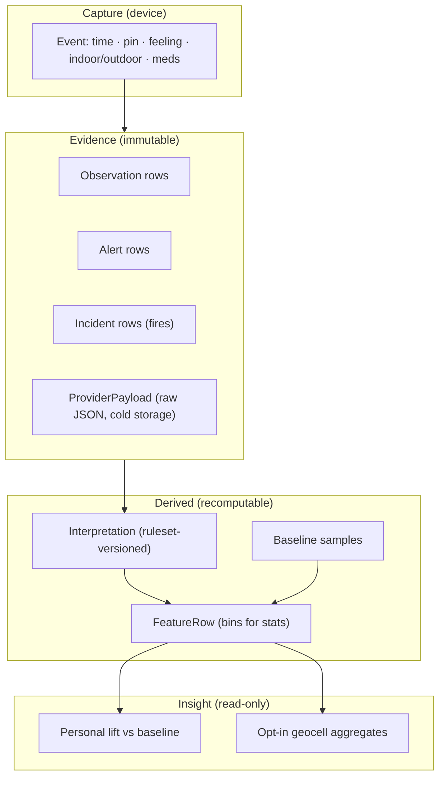
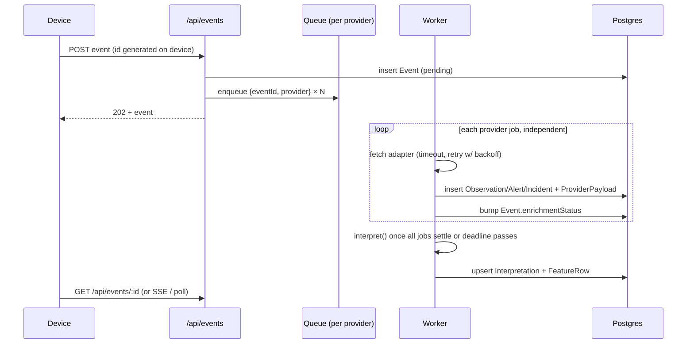

# Rewrite blueprint

Status: **draft for discussion** · Started 2026-09-04

This document is the starting point for a ground-up rewrite of the asthma trigger log. It covers principles, data architecture, information architecture, and UX, and it is written with scale in mind: many users, years of history, and interpretation rules that will keep changing.

It builds on two earlier briefs and does not repeat them:

- [Information / data architecture](./data-architecture.md) — the event / observation / alert model and privacy boundary.
- [Env signals and aggregators](./env-signals-and-aggregators.md) — per-signal honesty rules and what to ask vendors.

Where this document and those disagree, this one wins; fold changes back into them when the design settles.

---

## 0. Why rewrite

The current app is one Postgres table (`AttackLog`) with the *verdicts* baked in: `hasWildfireNearby`, `wildfireSummary`, `isExtremeTemp`, `stormSummary`, plus two JSON blobs. Every correction in the last month (industrial heat in Madison IL, the Zoeller Farm RX burn, the 0.1-acre Pinewoods fire) has been a change to interpretation logic that could not fix rows already written, so we added regex rewrites of stored prose on the client. That logic now lives in three places (`env-data.ts`, `env-badges.ts`, `home-client.tsx`), thresholds are scattered across five modules, and there are no tests.

The fix is not more filters. It is a model where **evidence is stored once and interpreted many times**.

---

## 1. Principles

1. **Store evidence, derive verdicts.** Raw provider facts (a PM2.5 reading, a named fire with acreage and containment, an NWS alert) are immutable rows. "Smoke likely at this point" is a derived field with a ruleset version. Change the rules, recompute history.
2. **Every number carries provenance.** Source, as-of time, spatial scale, distance from the user's pin, confidence. No bare `aqi` column. This is the honesty contract from the earlier brief, now enforced by the schema.
3. **Claim only what the data supports.** A 25-mile monitor is "regional outdoor air." A FIRMS pixel is "satellite heat," not a wildfire. A Red Flag Warning is fire *weather*, not smoke. Copy is generated from typed fields, never hand-written into the database.
4. **Personal first, population later.** The user's own baseline is the comparison that matters ("your PM2.5 on attack days vs your ordinary days"). Cohort and geographic aggregates are opt-in, k-anonymized, and never block v1.
5. **Offline is the normal case.** An attack is logged on a phone, possibly with no signal. The log must succeed locally in one tap and sync later. Enrichment is asynchronous and retryable.
6. **Vendor-agnostic core.** Providers are adapters that emit `Observation` and `Alert` rows. Swapping Ambee for Open-Meteo, or adding PurpleAir, touches one file and zero UI.
7. **Interpretation is pure and tested.** `interpret(observations, alerts) → Interpretation` has no I/O. Every false positive we have ever chased becomes a fixture.
8. **Privacy is structural.** Precise coordinates live only on the user's event. Anything aggregated uses a geocell and bins. Authentication and user scoping are part of the first schema, not a later add.
9. **Not medical advice, ever.** The product surfaces *context* and *correlation with your own history*. It never says "this caused your attack."

---

## 2. Data architecture

### 2.1 Layers



The rule: arrows only point downward. Nothing in *derived* or *insight* is ever the source of truth for anything.

### 2.2 Core entities

Names below are logical; Prisma casing is a detail.

**`User`** — id, createdAt, auth identity, `shareOptIn` (cohort aggregates), `homeGeocell` (optional, for baselines when GPS is unavailable).

**`Device`** — id, userId, platform, lastSeenAt. Owns the offline queue; a user may have several.

**`Event`** — the thing the user did.

| Column | Notes |
|--------|-------|
| `id` | UUID v7 (time-ordered; generated on device so offline writes are stable) |
| `userId`, `deviceId` | |
| `kind` | `attack` \| `baseline` \| `rescue_med` \| `symptom_check` |
| `loggedAt` | user-facing time, device clock |
| `receivedAt` | server time; used to detect clock skew |
| `latitude`, `longitude` | precise, user-owned; nullable if denied |
| `locationAccuracyM` | from the device |
| `indoorOutdoor` | `indoor` \| `outdoor` \| `unknown` |
| `feeling` | enum, editable |
| `note` | free text, editable |
| `enrichmentStatus` | `pending` \| `partial` \| `ready` \| `failed` |
| `deletedAt` | soft delete |

Events are append-mostly. Only `feeling`, `note`, `indoorOutdoor`, and `deletedAt` are mutable.

**`Observation`** — one measured or modeled value from one source.

| Column | Notes |
|--------|-------|
| `eventId` | |
| `metric` | `pm25` \| `pm10` \| `ozone` \| `no2` \| `aqi_us` \| `temp_f` \| `dewpoint_f` \| `humidity_pct` \| `wind_mph` \| `wind_dir_deg` \| `mixing_height_m` \| `pollen_tree` \| `pollen_grass` \| `pollen_weed` \| … (catalog in §2.5) |
| `value`, `unit` | numeric only; never a formatted string |
| `asOf` | observation or model-valid time |
| `provider` | `openaq` \| `airnow` \| `nws` \| `open_meteo` \| `ambee` \| `purpleair` \| … |
| `sourceId` | station / sensor / grid id |
| `sourceName` | human label for the station |
| `sourceLat`, `sourceLon`, `distanceKm` | where the value actually came from |
| `spatialScale` | `station` \| `sensor` \| `neighborhood` \| `model_grid` \| `region` |
| `confidence` | `high` \| `medium` \| `low` |
| `exposureKind` | `outdoor_ambient` today; leaves room for `indoor` / `personal` |

Multiple rows per metric per event are expected (OpenAQ station *and* AirNow *and* Ambee model). Nothing is merged at write time.

**`Alert`** — an official, named advisory in effect at the pin.

| Column | Notes |
|--------|-------|
| `eventId` | |
| `provider` | `nws` today |
| `externalId` | NWS alert id; dedupe key |
| `class` | `heat` \| `cold` \| `air_quality` \| `smoke` \| `fire_weather` \| `wind` \| `winter` \| `convective` \| `flood` \| `other` — mapped from the provider's own event type, never keyword-guessed |
| `eventName` | "Heat Advisory", "Red Flag Warning" |
| `severity`, `certainty`, `urgency` | passthrough |
| `onset`, `expires` | |
| `headline` | passthrough, display only |

**`Incident`** — a discrete fire (or, later, other hazard) with a location. Separate from `Alert` because incidents have geometry, size, and lifecycle.

| Column | Notes |
|--------|-------|
| `eventId` | |
| `provider` | `ambee_disaster` \| `ambee_fire` \| `firms` \| `watchduty` \| `nifc` |
| `externalId` | provider's id when present |
| `kind` | `reported_fire` \| `satellite_heat` \| `prescribed_burn` \| `structure_fire` \| `other` — classified from provider fields, with the classifier versioned |
| `name` | as reported; may be null |
| `latitude`, `longitude`, `distanceKm`, `bearingDeg` | |
| `placeLabel` | reverse-geocoded "Carter County, MO" (cached per rounded point) |
| `startedAt`, `updatedAt`, `expiresAt` | |
| `burnedAreaAcres`, `containedPct`, `frpMw`, `detectionConfidence` | nullable |

The Pinewoods case becomes a plain row: `kind=reported_fire, burnedAreaAcres=0.1, containedPct=100, updatedAt=Aug 24`. Whether it matters is the interpreter's job.

**`ProviderPayload`** — `eventId, provider, fetchedAt, httpStatus, durationMs, body (JSONB)`. Written to a separate table (later: object storage) so the hot tables stay small. Retention policy: 90 days full, then drop `body` and keep metadata.

**`Interpretation`** — the verdicts, recomputable.

| Column | Notes |
|--------|-------|
| `eventId` | |
| `rulesetVersion` | semver string; bumped whenever `interpret()` changes behaviour |
| `computedAt` | |
| `smokeAtPoint` | `none` \| `possible` \| `likely` — from PM2.5 + smoke alerts + (later) HMS plume |
| `smokeAttributedIncidentId` | nullable FK to `Incident` — only set when the gate in §2.4 passes |
| `fireWeather` | boolean, from `Alert.class = fire_weather` |
| `nearestCredibleFireId` | nullable FK; nearest `Incident` that passes the "landscape wildfire" filter |
| `heatStress`, `coldStress` | `none` \| `elevated` \| `extreme` — from temp + dewpoint + heat alerts |
| `stagnantAir` | `unknown` \| `unlikely` \| `possible` — from mixing height |
| `pollenRisk` | `unknown` \| `low` \| `moderate` \| `high` \| `very_high` |
| `airQualityBand` | `good` \| `moderate` \| `usg` \| `unhealthy` \| `very_unhealthy` \| `hazardous` — with `drivingPollutant` |
| `primaryObservationIds` | JSON array — which rows each verdict used, for the "how do we know?" drawer |

One row per event per ruleset version. The UI reads the latest version; older versions are kept so a user can see "we changed our mind about this day and why."

**`FeatureRow`** — flat bins for statistics (`pm25_band`, `temp_band`, `pollen_risk`, `hour_of_day`, `day_of_week`, `smoke_at_point`, …). Derived from `Interpretation` + `Observation`. Contains no coordinates and no free text.

### 2.3 Baselines

Insights are impossible without non-attack samples. Three ways to get them, cheapest first:

1. **Passive:** when the app is opened and no event is logged, record a `baseline` event with the current pin (rounded to ~1 km) and enrich it. Rate-limited to a few per day.
2. **Scheduled:** an opt-in daily check-in notification ("How's your breathing?") that creates a `symptom_check` event with a feeling.
3. **Synthetic:** for users who share a home geocell, enrich that cell hourly and store as `Observation` rows with `eventId = null, userId, geocell, hour`. This is a time series per user rather than per event and is what makes lag features ("was it 95°F yesterday?") possible.

Option 3 is the scale concern: hourly × users × providers. Dedupe by geocell so ten users in one cell cost one call. See §2.7.

### 2.4 The interpreter

`src/lib/interpret/` — pure TypeScript, no fetch, no Prisma.

```
interpret(input: { event, observations, alerts, incidents, now }): Interpretation
```

Rules that already exist in scattered form, to be centralised in `thresholds.ts`:

| Rule | Current value | Source module today |
|------|---------------|---------------------|
| Smoky air (weak) | PM2.5 ≥ 12 µg/m³ or AQI ≥ 51 or NWS smoke/AQ alert | `hazard-copy.ts` |
| Smoky air (strong) | PM2.5 ≥ 35.5 or AQI ≥ 101 or NWS smoke | `ambee.ts` |
| Local fire radius | ≤ 50 km | `env-data.ts` |
| Regional fire radius | 50–80 km | `env-data.ts`, `hazard-copy.ts` |
| Landscape wildfire | not RX/prescribed/structure; ≤ 72 h old; ≥ 10 acres if known; not 100 % contained unless < 12 h | `ambee.ts` |
| Regional smoke attribution | landscape wildfire AND (strong smoky air OR large fire ≥ 100 acres with weak smoky air) | `ambee.ts` |
| Extreme temp | ≤ 20 °F or ≥ 95 °F | `env-data.ts` |
| Inversion heuristic | calm, clear, ≥ 15 °F diurnal spread | `env-data.ts` |

The interpreter also decides what is *not* claimed. If the only fire signal is a FIRMS pixel and PM2.5 is Good, `nearestCredibleFireId` may be set but `smokeAtPoint = none`, and the UI says "satellite heat nearby, air still clean."

Testing: Vitest fixtures under `src/lib/interpret/__fixtures__/` — one JSON per real case (Madison IL industrial heat, Zoeller Farm RX, Pinewoods, a real June 2023 Canadian plume over the Midwest, a Denver ozone day, a clean control). CI runs them on every PR.

### 2.5 Metric catalog

A single `metrics.ts` exports the canonical list with unit, display precision, and band edges. Anything not in the catalog is rejected at the adapter boundary. Initial set:

`pm25 (µg/m³)`, `pm10`, `ozone (ppb)`, `no2 (ppb)`, `aqi_us`, `temp_f`, `dewpoint_f`, `humidity_pct`, `heat_index_f`, `wind_mph`, `wind_dir_deg`, `pressure_hpa`, `mixing_height_m`, `pollen_tree`, `pollen_grass`, `pollen_weed`, `pollen_risk_index`, `cloud_cover_pct`, `precip_in`.

### 2.6 Provider adapters

`src/lib/providers/<name>.ts`, each exporting:

```ts
export const nws: Provider = {
  id: "nws",
  metrics: ["temp_f", "dewpoint_f", "wind_mph", ...],
  emits: ["observation", "alert"],
  async fetch(ctx: { lat, lon, at, signal }): Promise<ProviderResult>,
};
```

`ProviderResult = { observations: Observation[], alerts: Alert[], incidents: Incident[], raw: unknown, meta: { durationMs, httpStatus } }`.

Adapters are dumb: they translate, they do not judge. Classification of `Incident.kind` (RX vs wildfire) is the one exception, and it is shared code with its own tests, not per-adapter regex.

Planned adapters and what they are for:

| Adapter | Emits | Priority |
|---------|-------|----------|
| `nws` | station obs (METAR), alerts | v1 |
| `openaq` | pm25 / ozone / no2 with station + km | v1 |
| `airnow` | aqi_us fallback, smoke-corrected PM | v1 |
| `open_meteo` | hourly temp / dewpoint / wind / `boundary_layer_height` | v1 (replaces inversion heuristic) |
| `firms` | satellite_heat incidents with FRP + confidence | v1 |
| `ambee` | pollen; disaster WF incidents; model AQ as a labelled fallback | v1 for pollen, v2 for the rest |
| `noaa_hms` | smoke plume polygons → `smokeAtPoint` evidence | v2 |
| `purpleair` | nearby low-cost PM sensors, EPA-corrected | v2 |
| `watchduty` / `nifc` | authoritative named fires with perimeter | v2 |

### 2.7 Enrichment pipeline



Design points:

- **One job per provider per event.** A slow Ambee call never delays the AirNow value. A failed provider retries alone.
- **Deadline, not barrier.** Interpretation runs at the earlier of "all providers settled" or 60 s, then again if late data arrives (`Interpretation` is upsert-by-version).
- **Idempotent.** Jobs key on `(eventId, provider)`. Re-running a job replaces that provider's rows and nothing else.
- **Cache by rounded point + hour.** Two events 300 m apart within the same hour share provider responses. Key: `(provider, geocell_res8, floor(at, 1h))`. This is what keeps cost linear in *distinct places*, not in events.
- **Rate limits are per provider, global.** A token bucket per adapter in Redis / Upstash so one burst of logs cannot exhaust the FIRMS key.
- **Backfill is the same pipeline.** Re-enrich any event by enqueueing its jobs again; re-interpret all events by bumping `rulesetVersion` and running a batch that reads existing evidence rows only (no provider calls).

Infrastructure on Vercel: Vercel Queues or Upstash QStash for the job fan-out, Vercel Functions for workers, Postgres (Neon or Supabase) with JSONB for payloads, Vercel Blob for payload cold storage after 90 days.

### 2.8 Scale envelope

Rough targets so the design has something to be checked against.

| Dimension | v1 (personal) | v2 (small cohort) | v3 |
|-----------|---------------|-------------------|----|
| Users | 1–10 | 1k | 100k |
| Events / day | < 10 | 2k | 200k |
| Baseline samples / day | 0–30 | 5k | 500k (geocell-deduped) |
| Provider calls / day | < 100 | ~10k | ~200k (cache hit rate matters) |
| Observation rows / year | ~10k | ~10M | ~1B → partition by month |
| Payload storage / year | MB | ~10 GB | TB → Blob, not Postgres |

Indexes that matter from day one: `Event(userId, loggedAt desc)`, `Observation(eventId)`, `Observation(userId, metric, asOf)` for baselines, `Interpretation(eventId, rulesetVersion desc)`. Partition `Observation` and `ProviderPayload` by month when rows pass ~50M.

Precise `latitude/longitude` never leave `Event`. `FeatureRow` and cohort tables carry only an H3 cell (resolution 6–7, ~5–35 km²) chosen so that k ≥ 20 users per cell before anything is published.

### 2.9 Migration from today's schema

1. Add new tables alongside `AttackLog`. Write both for one release.
2. Backfill: `envRawJson` already contains every provider response — run the adapters' *translate* step over stored payloads to create `Observation` / `Alert` / `Incident` rows for all history. No new API calls.
3. Run `interpret()` at `rulesetVersion = 1.0.0` over all events. Diff against `hasWildfireNearby` / `stormSummary` and review the disagreements by hand — that diff is the acceptance test for the rewrite.
4. Point the UI at `Interpretation`. Delete `rewriteFireLabel`, `rewriteStormLabel`, `parseDistanceToken`, `collapsedFireHint`'s regexes.
5. Drop the verdict columns from `AttackLog`; rename to `Event`.

---

## 3. Information architecture

### 3.1 Objects the user thinks about

| Object | What it is to the user | Backed by |
|--------|------------------------|-----------|
| **Entry** | "I had an attack at 4:10 pm at the park" | `Event` |
| **Conditions** | "what the outdoor air was like then" | `Observation` + `Alert` + `Incident`, summarised by `Interpretation` |
| **Signal** | one hazard family: Air, Heat/Cold, Smoke & fire, Pollen, Weather alerts, Stagnant air | a slice of `Interpretation` |
| **Evidence** | "how do you know?" — the station, distance, time, source | the `primaryObservationIds` behind a signal |
| **Pattern** | "my attacks cluster on high-PM afternoons" | `FeatureRow` vs baselines |
| **History** | list / calendar of entries | `Event` |

### 3.2 Navigation

```
Home (Log)                  ← the one-tap surface; always first
├─ Entry detail
│  ├─ Conditions (signals, collapsed by default)
│  │  └─ Signal detail → Evidence drawer
│  └─ Edit feeling / note / indoor-outdoor
History
├─ List (default)
├─ Calendar
└─ Filters (feeling, signal, month)
Patterns                    ← empty state until ≥ N attacks + baselines
├─ Your triggers (personal lift)
└─ Compared to your baseline
Settings
├─ Account & devices
├─ Baseline sampling (off / passive / daily check-in)
├─ Sharing (cohort opt-in, explained plainly)
├─ Units, data export, delete everything
└─ About the data (sources, what we do / don't claim)
```

Four top-level destinations, no more. Everything about *why* lives one tap under the entry, never on the list.

### 3.3 Signal taxonomy (what a "badge" can be)

Replaces the current four badges (AQI, temp, storm, wildfire) with six families, each with a fixed set of states so copy is generated rather than authored:

| Family | States | Primary evidence |
|--------|--------|------------------|
| **Air** | good · moderate · unhealthy for sensitive · unhealthy · very unhealthy · hazardous · unknown | `pm25`, `ozone`, `aqi_us` + driving pollutant + station distance |
| **Smoke & fire** | none · fire weather only · satellite heat nearby (air clean) · smoke possible · smoke likely (+ attributed fire) | PM2.5, smoke alerts, `Incident`, HMS plume |
| **Heat / cold** | comfortable · warm · hot · extreme heat · cold · extreme cold | `temp_f`, `dewpoint_f`, heat/cold alerts |
| **Pollen** | low · moderate · high · very high · unknown | pollen metrics |
| **Weather alerts** | list of named NWS events, grouped by class | `Alert` |
| **Stagnant air** | unknown · unlikely · possible | `mixing_height_m`, wind |

Every state has exactly one copy template. "Wildfire nearby" as a string no longer exists in the system.

### 3.4 Copy rules

- Lead with the *state*, then the *evidence*, then the *scale*: "Smoke likely · PM2.5 48 µg/m³ · Granite City monitor, 6 mi · 3:00 pm".
- Distance words: within 2 mi → "nearby sensor"; 2–10 → "N mi away"; > 10 → "regional".
- Time words: < 90 min → "just now / 3:00 pm"; older → "as of 3:00 pm (2 h before your log)".
- Model vs measurement is always stated: "modeled" appears in the line whenever `spatialScale = model_grid`.
- Fire names are shown only for `Incident.kind = reported_fire` with a `placeLabel`: "Pinewoods Fire · Carter County, MO · 110 mi SW". Satellite heat never gets a name.
- Negative claims are explicit and cheap to show: "Fire weather warning · no smoke detected here."

### 3.5 Data export

Users own the data. Export is a first-class object, not a settings afterthought: JSON and CSV of `Event` + `Interpretation` + a flattened `Observation` table, with a data dictionary. Clinician-oriented PDF summary later.

---

## 4. UX considerations

### 4.1 The log tap

The entire product is judged on the moment someone is short of breath and reaches for their phone.

- **One tap, no form.** Big button, immediate confirmation, entry appears in the list with a "Getting conditions…" placeholder. Feeling, note, indoor/outdoor are optional follow-ups that can be filled in later.
- **Works with no network and no location.** Local write always succeeds. If GPS is denied or times out, log anyway and offer "use last known / home" afterwards.
- **Widget / shortcut / lock screen.** iOS Shortcut and Android widget that fire the same `POST /api/events` with device-generated id. Voice ("log an asthma attack") via the same path.
- **Haptic + visual confirmation within 100 ms.** Enrichment latency (seconds) must never be on the critical path.
- **Never ask a question first.** No "how bad is it?" modal blocking the tap.

### 4.2 Progressive disclosure of conditions

Three depths, each one tap deeper:

1. **List row:** time, feeling dot, and at most two signal chips in a fixed priority order (Smoke → Air → Heat/Cold → Pollen → Alerts → Stagnant). Chips show state only ("Smoke likely", "Air moderate").
2. **Entry detail:** all six families as a compact card list, each with the one-line copy from §3.4. Unknown families are shown greyed, not hidden, so "we don't have pollen data" is visible.
3. **Evidence drawer:** for a family, the observation rows that fed it — source, station, distance, as-of, value — plus the ruleset version and a "this changed on <date>" note if a later interpretation differs from what the user originally saw.

### 4.3 Honesty as a feature

- **A "how do we know?" link on every signal**, not a tooltip. Tooltips are invisible on mobile.
- **Scale is visual.** A small "station · 6 mi" or "model" tag on every value. Consider a three-segment glyph (sensor / regional / modeled).
- **Confidence colour is separate from severity colour.** Severity uses the AQI palette users already know; confidence uses opacity or a dashed border. Never make a low-confidence value look as solid as a measured one.
- **Show what's missing.** "No monitor within 25 mi — regional model used" beats a confident number.
- **Retro-corrections are surfaced, not silent.** When a ruleset bump changes an old entry's verdict, the entry shows a subtle "updated" mark with a one-line reason ("we no longer count fully contained fires as smoke sources").

### 4.4 Patterns without false authority

- Locked until the user has both enough attacks (~10) and enough baseline samples (~30). The empty state explains why and offers to turn on passive baselines.
- Present as **relative frequency vs your baseline**, with counts visible: "7 of your 12 attacks were on days with PM2.5 over 35 · that's true of 2 in 10 of your ordinary days." No p-values, no "risk score."
- Show the *absence* of a pattern as clearly as presence: "Heat doesn't seem to matter for you so far."
- Per-signal, never a composite "trigger score."
- Always a "share with a clinician" export from this screen.

### 4.5 Accessibility and context of use

- Assume one-handed, possibly shaking, possibly in bright sunlight. Minimum 44 pt targets, high-contrast default, large-type support without layout breakage.
- Colour never carries meaning alone; every state has a text label and, for air bands, a pattern/icon.
- Reduced motion respected; no animated enrichment spinner longer than a pulse.
- Screen-reader order: time → feeling → most important signal → the rest.
- Works as an installable PWA on iOS and Android before any native build is considered.

### 4.6 Trust, privacy, consent

- First-run explains in three sentences what is stored (time, place, how you felt), what is fetched (outdoor conditions), and what is never claimed (cause, indoor air, medical advice).
- Location permission is requested *on the first tap*, in context, with "log without location" as an equal option.
- Sharing to cohort aggregates is off by default, one toggle, with the k-anonymity rule stated plainly ("only shown when at least 20 people are in the same area").
- Delete-everything is one screen, immediate, and includes provider payloads.

### 4.7 Onboarding and empty states

- Zero configuration to log the first attack.
- The first entry's detail view doubles as the tutorial: each family's card explains itself once ("Air: from the nearest official monitor. We show how far away it is.").
- Baseline sampling is offered *after* the second or third attack, when the user has seen conditions and can understand why "ordinary days" matter.

---

## 5. Non-goals for the rewrite

- Indoor or personal-exposure sensing (different product; leave the `exposureKind` slot).
- Clinical decision support or symptom scoring beyond a feeling enum.
- Global coverage on day one. US-first; NWS, AirNow, OpenAQ, FIRMS are strong here. Adapters make expansion possible later.
- A native app. PWA + shortcuts first.
- Social features.

---

## 6. Open questions

1. **Queue infrastructure:** Vercel Queues vs Upstash QStash vs a simple Postgres job table with `FOR UPDATE SKIP LOCKED`. The last is enough for v1 and v2 and has no new vendor.
2. **Auth provider:** Clerk vs Supabase Auth vs passkeys-only. Requirement: works offline after first sign-in, no password.
3. **Smoke-at-point evidence:** is NOAA HMS plume data reliable enough hourly, or do we treat PM2.5 as the smoke sensor and use HMS only as a tiebreaker?
4. **Baseline sampling:** passive-on-open vs daily notification — which gets more consistent samples without feeling like surveillance?
5. **How far back to re-interpret:** all history on every ruleset bump, or only entries the user has viewed?
6. **Geocell resolution** for cache dedupe (res 8, ~0.7 km²) vs for aggregates (res 6–7). Two different constants, easy to conflate.

---

## 7. Suggested order of work

Ordered by what unblocks the most, not by user-visible flash.

1. `metrics.ts` catalog, `Observation` / `Alert` / `Incident` types, and the `interpret()` module with fixtures from the four real cases we have already debugged. Pure code, no schema, mergeable independently.
2. New Prisma schema alongside `AttackLog`; dual-write from the current `enrichEnvironment`.
3. Backfill from `envRawJson`; run the interpreter over history; review the diff.
4. Provider adapters extracted one at a time (NWS → OpenAQ → AirNow → FIRMS → Ambee), each replacing a slice of `env-data.ts`.
5. Job-per-provider pipeline with the Postgres job table.
6. UI on `Interpretation`: list chips → entry cards → evidence drawer. Delete the string rewrites.
7. Auth + user scoping; passive baselines; Patterns screen.
8. Cohort aggregates, HMS, PurpleAir, native shortcuts.
